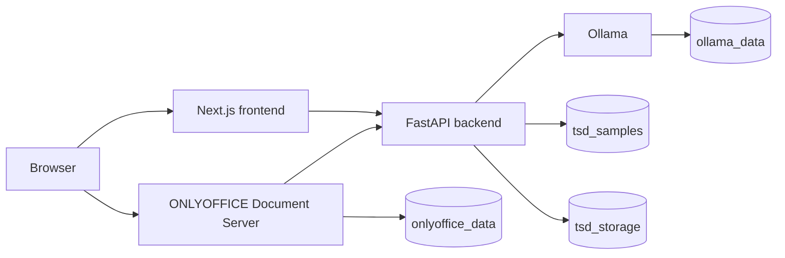

# Arsitektur TSD Engine

Dokumen ini menjelaskan struktur teknis, alur data, penyimpanan, integrasi, dan
batasan TSD Engine sebagai acuan pengembangan lanjutan oleh perusahaan.

## 1. Tujuan Sistem

TSD Engine menggabungkan dokumen Technical Specification Document (DOCX) dan
script SQL menjadi satu indeks pencarian. Pengguna dapat mencari stored
procedure, membaca diagram dan lineage, memeriksa kualitas TSD, mengelola status
dokumen, mengedit DOCX, dan memperoleh ringkasan AI lokal.

Sistem tidak bergantung pada SharePoint. Seluruh sumber dan hasil pemrosesan
disimpan pada Docker volumes di lingkungan perusahaan.

## 2. Technology Stack

| Lapisan | Teknologi |
| --- | --- |
| Frontend | Next.js 16, React 19, TypeScript, Tailwind CSS 4 |
| UI | Lucide React, server components, client components |
| Backend | Python 3.13, FastAPI, Uvicorn, Pydantic |
| Dokumen | python-docx, lxml, LibreOffice headless |
| Pencarian | SQLite, FTS5, RapidFuzz |
| AI | Ollama lokal, model default `llama3.2:3b` |
| Editor Word | ONLYOFFICE Document Server, callback JWT |
| Deployment | Docker Compose, named volumes |

## 3. Topologi Layanan



- `frontend` menyajikan UI dan memanggil backend melalui jaringan Compose.
- `backend` menangani parser, pencarian, dokumen, PDF, checker, editor, dan AI.
- `documentserver` membuka dan mengedit DOCX di browser.
- `ollama` menjalankan model tanpa mengirim isi TSD/SQL ke cloud.

Port host dikonfigurasi melalui `.env`; port internal antar-container tetap.

## 4. Struktur Source Code

```text
frontend/
  src/app/                 route dan halaman Next.js
  src/components/          pencarian, dokumen, editor, dan diagram
  src/lib/api.ts           kontrak client FastAPI
backend/
  app/api/routes.py        endpoint HTTP
  app/parsers/             parser DOCX dan SQL
  app/indexer/             ingestion dan pembentukan index
  app/db/                  akses SQLite dan cache AI
  app/documents/           repository, PDF, dan ONLYOFFICE
  app/quality/             aturan quality checker
  app/ai/                  Ollama dan fallback SQL
  samples/                 seed DOCX/SQL untuk volume baru
docs/                      panduan dan dokumen arsitektur
compose.yaml               definisi layanan dan volume
```

## 5. Penyimpanan Persisten

| Volume | Isi |
| --- | --- |
| `tsd_samples` | DOCX dan SQL sumber aktif |
| `tsd_storage` | SQLite, JSON parse, gambar, PDF, registry, checker, AI cache |
| `ollama_data` | model Ollama |
| `onlyoffice_data` | konfigurasi/data Document Server |
| `onlyoffice_logs` | log ONLYOFFICE |

Struktur utama `tsd_storage`:

```text
storage/
  tsd_index.db
  parsed/
    <nama-dokumen>.json
    sql/
  images/
  documents/
    registry.json
    inactive/
    pdf/
  quality/
    reports/
    staging/
  ai_cache.db
```

Container bersifat disposable. Data bertahan selama volumes tidak dihapus.
`docker compose down -v` menghapus data persisten.

## 6. Inisialisasi dan Seed

1. Entry point backend membuat folder storage.
2. Pada volume baru, DOCX/SQL dari `backend/samples/` disalin ke `tsd_samples`.
3. Parser menghasilkan JSON dan gambar.
4. Indexer membangun SQLite FTS5.
5. Marker `.docker-initialized` mencegah seed berulang saat restart.

Seed hanya untuk bootstrap. Setelah berjalan, sumber dikelola melalui aplikasi.

## 7. Pipeline Parsing dan Index

Parser DOCX membaca metadata, heading, TOC, tabel, stored procedure, Data Model,
Data Flow, uraian proses, dan table specification. Parser SQL mendeteksi definisi
prosedur, parameter, operasi baca/tulis, tabel, pemanggilan, file, dan baris.

Indexer menggabungkan kedua sumber menjadi status:

- `matched`: SP ditemukan pada SQL dan TSD.
- `doc_only`: hanya ditemukan pada TSD.
- `sql_only`: hanya ditemukan pada SQL.
- `sql_variant`: salinan atau versi arsip SQL.

FTS5 menangani pencarian teks dan RapidFuzz membantu pencocokan nama. Salinan
arsip dapat disembunyikan dari hasil cepat.

## 8. Alur Pencarian

1. Frontend mengirim query/filter ke `/api/search`.
2. Backend mencari SQLite dan mengurutkan hasil utama sebelum arsip.
3. `/api/sp/{sp_name}` mengembalikan detail prosedur.
4. Detail menggabungkan SQL, occurrence TSD, diagram, tabel, dan confidence.
5. Gambar dilayani dari storage backend.

## 9. Analisis AI

1. Backend menyusun konteks dari SQL, TSD, tabel, parameter, dan diagram.
2. Hash konteks dan versi prompt menjadi cache key.
3. Hasil cache dipakai selama sumber belum berubah.
4. Backend meminta JSON terstruktur dari Ollama bila cache belum ada.
5. Fakta tabel dan confidence dikunci kembali terhadap index.
6. Jika model melewati timeout dan SQL tersedia, backend memakai fallback
   deterministik berbasis SQL.

AI adalah alat bantu. Informasi tanpa bukti tetap ditandai untuk verifikasi.

## 10. Quality Checker

Upload ditempatkan di staging dan tidak langsung menjadi sumber. Checker meliputi:

- integritas DOCX, identitas, metadata tanggal, dan change control;
- sinkronisasi TOC, bab wajib, hierarki dan penomoran Heading 1-6;
- duplikasi nomor dan parent number;
- pasangan Data Model, Data Flow, dan interpretasi;
- kelengkapan table specification.

Laporan disimpan sebagai JSON. Hanya skor 100% yang dapat diaktifkan. Aktivasi
memindahkan file ke sumber aktif, menjalankan parser, dan rebuild index.

## 11. Lifecycle Dokumen

### Nonaktifkan dan aktifkan kembali

Saat nonaktif, DOCX dipindahkan ke `documents/inactive`, hasil parse ditahan,
registry diperbarui, dan index dibangun ulang. Aktivasi mengembalikan file dan
hasil parse ke lokasi aktif lalu rebuild index.

### Hapus

File dan hasil parse dipindahkan sementara selama rebuild. Operasi dipulihkan
jika gagal; jika berhasil, file dan registry dihapus permanen.

### Rename dan metadata

Nama baru divalidasi dan diperiksa agar tidak bentrok. Sumber aktif dipindahkan,
diparsing ulang, di-index ulang, lalu key registry diperbarui. Jika tahap gagal,
nama dan hasil parse lama dipulihkan. Dokumen nonaktif direname tanpa dimasukkan
kembali ke index.

## 12. Editor ONLYOFFICE

1. Frontend meminta konfigurasi editor dari backend.
2. Backend membuat source URL, callback URL, document key, dan JWT.
3. ONLYOFFICE mengambil DOCX melalui endpoint bertoken.
4. Setelah Save, ONLYOFFICE mengirim callback dan URL hasil edit.
5. Backend mengunduh serta memvalidasi hasil.
6. DOCX diganti secara atomik, diparsing ulang, dan index dibangun ulang.
7. Cache PDF dihapus dan timestamp registry diperbarui.

Document key mengikuti versi file agar editor tidak memakai backup copy lama.

## 13. Preview PDF dan Download

LibreOffice headless mengonversi DOCX ke PDF. Cache berlaku sampai DOCX berubah.
Konversi dikunci untuk mencegah request paralel memproses file yang sama, dan
setiap proses memakai temporary user profile terpisah.

Download DOCX memakai `no-store` dan version query agar browser mengambil versi
terbaru setelah edit.

## 14. API Utama

| Endpoint | Fungsi |
| --- | --- |
| `GET /api/health` | kesehatan backend/index |
| `GET /api/stats` | statistik ringkasan |
| `GET /api/search` | pencarian dan filter |
| `GET /api/sp/{name}` | detail stored procedure |
| `POST /api/sp/{name}/analysis` | analisis AI |
| `GET /api/segments` | repository dokumen |
| `POST /api/documents/check` | quality checker |
| `POST /api/documents/checks/{id}/activate` | aktivasi hasil lulus |
| `GET /api/documents/{filename}/pdf` | preview/download PDF |
| `GET /api/documents/{filename}/download` | download DOCX |
| `PUT /api/documents/{filename}/metadata` | rename, modul, dan tag |
| `POST /api/documents/{filename}/deactivate` | nonaktifkan |
| `POST /api/documents/{filename}/activate` | aktifkan kembali |
| `DELETE /api/documents/{filename}` | hapus permanen |
| `GET /api/documents/{filename}/editor-config` | konfigurasi editor |
| `POST /api/documents/{filename}/editor-callback` | simpan hasil editor |

OpenAPI tersedia pada `/docs` di port backend.

## 15. Konsistensi dan Concurrency

Backend memakai satu worker. Operasi file/index memakai process lock dan rollback
jika rebuild gagal. PDF memiliki lock terpisah. Ini sesuai untuk instalasi
internal tunggal, bukan cluster multi-instance.

Untuk skala besar, gunakan PostgreSQL, object storage, search service, job queue,
dan distributed locking.

## 16. Keamanan

Saat ini tersedia validasi nama/ukuran/struktur DOCX, CORS, dan JWT callback
ONLYOFFICE. Sebelum produksi perusahaan perlu menambah:

- autentikasi, session, dan role-based access control;
- TLS reverse proxy dan secret manager;
- audit log perubahan dokumen;
- antivirus scanning upload;
- rate limit dan pembatasan jaringan;
- backup terenkripsi, monitoring, dan central log.

Jangan mengekspos backend, Ollama, atau ONLYOFFICE langsung ke internet.

## 17. Backup dan Disaster Recovery

Source disimpan pada private Git; runtime data dicadangkan dari Docker volumes.
Backup dilakukan ketika layanan penulis dihentikan agar SQLite, DOCX, dan
registry konsisten. Prosedur ada di `docs/INSTALLATION_GUIDE.md`.

Backup harus diuji restore secara berkala.

## 18. Batasan Saat Ini

- Belum ada login, role, dan audit trail per pengguna.
- SQLite dan process lock membatasi satu backend instance.
- Rebuild index masih sinkron.
- ONLYOFFICE pada Apple Silicon memakai emulasi `linux/amd64`.
- Akurasi AI bergantung pada kualitas sumber dan model lokal.
- Rename/edit bersamaan belum memakai distributed lock.
- Tidak ada sinkronisasi SharePoint atau cloud provider.

## 19. Dokumen Terkait

- `README.md`: ringkasan dan quick start.
- `docs/INSTALLATION_GUIDE.md`: instalasi, migrasi, backup, dan troubleshooting.
- `docs/USER_GUIDE.md`: penggunaan fitur oleh pengguna akhir.
